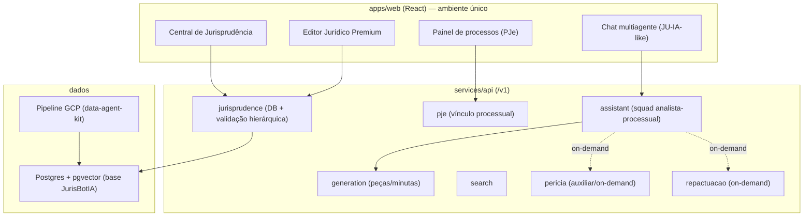

# Blueprint de Convergência — Solução Jurídica Única (Legal AI)

> Documento de referência versionado. O **ponto focal** de implementação é o
> repositório `felippepestana/legal-ai-advocacia-brasil`. Este documento vive em
> `aiox-squads-felippepestana` apenas como registro/handoff, porque este é o
> único repositório com acesso de escrita a partir do agente que o produziu.

Última atualização: 2026-06-02.

## 1. Objetivo

Consolidar o `legal-ai-advocacia-brasil` como uma solução jurídica única,
integrando o conteúdo faltante de repositórios auxiliares e construindo um
ambiente web intuitivo de acesso facilitado aos agentes (multiagentes).

## 2. Restrições de acesso conhecidas

| Item | Situação |
|------|----------|
| Escrita no repo foco (`legal-ai-advocacia-brasil`) | Necessária para o agente executor (Cloud Agent baseado no repo foco). |
| Repos acessíveis (leitura) | `aiox-squads-felippepestana`, `JurisBotIA`, `data-agent-kit-starter-pack`, `consulta_pje`, `lavern-advai-opensource`, `apex-legal-performance`. |
| Repos sem acesso (privados/app não instalado) | `repactuador-online`, `jurisprudencia-brasil`, `EditorTextoJur-dicoPremium`, `juridic-ai-nexus`. Conceder acesso ao app Cursor ou portar conteúdo manualmente. |

## 3. Estado atual do repo foco (`legal-ai-advocacia-brasil` v2.0.2)

Plataforma madura (não esqueleto):

- **API FastAPI** em `services/api` (`/v1`): rotas `documents`, `deadlines`,
  `calculator`, `search`, `generation`, `assistant`, `analytics`, `workflows`,
  `audit`, `meta`. Adapters em `services/api/adapters/`.
- `packages/legal_sources/`: `datajud`, `lexml`, `senado_legislacao`,
  `jurisprudencias`, `aggregator`, `cache`.
- `packages/ai_provider/` (Gemini/Vertex), `packages/legal_core/` (validadores
  CPC, ontologia, prompts), `packages/infra/redis.py`.
- `apps/web/` (React + Vite + Tailwind). Multi-tenant (`X-API-Key`), rate limit,
  auditoria LGPD, Sentry, Cloud Run.
- Hub `advocacia-brasil-hub/` e squad `analista-processual-estrategico/`.
- Testes em `tests/` (pytest); CI em `.github/workflows/ci.yml`.

## 4. Fontes a integrar e seus papéis

| Repo | O que é | Papel na convergência |
|------|---------|-----------------------|
| `aiox-squads-felippepestana` | Squads jurídicos + `analista-processual-web` (Next.js) com `harmonizeLegalRequest()`, use cases `UC-LP-001..008`, quality gates `QG-LP-*`, agentes (pesquisa, estratégia, recursal, perícia em `web/server/pericia.ts`). | Fonte canônica dos **agentes** e do pipeline de harmonização. |
| `JurisBotIA` | Clone do monorepo Supabase (Postgres + Auth + `pgvector` + Edge Functions). | Fundação de dados/auth/busca semântica da central de jurisprudência. |
| `data-agent-kit-starter-pack` | Skills + MCP do Google Cloud Data (BigQuery/dbt/Spark). | Pipeline de ingestão/atualização do acervo de julgados. |
| `consulta_pje` | Scripts/notebooks da API pública do PJe (inclui captcha). | Vínculo automático a processos judiciais. |
| `lavern-advai-opensource` | Clone do Lavern: 67 agentes, protocolo de debate, gate humano, verificação em camadas. | Arquitetura-referência multiagentes/verificação. |
| `apex-legal-performance` | Monorepo-plano (Turbo/pnpm) "produto canônico"; docs + estrutura. | Visão de produto/arquitetura e design para o front unificado. |
| `juridic-ai-nexus` (sem acesso) | Design da solução única. | Identidade/UX do ambiente web. |
| `EditorTextoJur-dicoPremium` (sem acesso) | Editor jurídico inteligente com IA. | Base do módulo Editor Premium. |
| `repactuador-online` (sem acesso) | Atuação em repactuação de PF/PJ. | Funcionalidade pontual on-demand. |
| `jurisprudencia-brasil` (sem acesso) | Acervo de jurisprudência. | Conteúdo da central de jurisprudência. |

## 5. Arquitetura-alvo

## 6. Requisitos → implementação (no repo foco)

### 6.1 Perícia auxiliar (on-demand)

Portar a lógica de perícia (`aiox` `web/server/pericia.ts` + agentes) para
`services/api/routes/pericia.py` + adapter. Acionável **apenas** quando a demanda
exigir (gate explícito no `assistant`). Não incluir nos workflows regulares;
disponível como ferramenta. Nem todo processo usa perícia.

### 6.2 Central de Jurisprudência + Chatbot IA (estilo JusBrasil / JU IA)

- Estender `packages/legal_sources/jurisprudencias.py` com banco persistente
  (Postgres + `pgvector`, base `JurisBotIA`) e pipeline de atualização
  (`data-agent-kit`/GCP).
- Composição do acervo: julgados e precedentes classificados por hierarquia e
  órgão julgador. Prioridade: **STF → STJ → Tribunais Superiores**; de TRFs/TJs,
  apenas repetitivos, julgamentos qualificados, súmulas e entendimentos
  sedimentados (ex.: dano moral presumido em falha de produto/serviço).
- Janela de **5 anos**; **validação hierárquica contínua** (comparar com o
  próprio tribunal e com instâncias superiores) — sinalizar ao usuário quando
  houver precedente contrário em âmbito superior, mesmo se o tribunal mantém o
  entendimento.
- Função "salvar precedente": pesquisas do usuário alimentam o acervo.
- Chatbot rodando sobre o squad de análise processual (route `assistant`),
  conversa humanizada, capaz de gerar minuta/estratégia (segundo meio de uso dos
  multiagentes).
- Pesquisar e adotar modelos de mercado validados: RAG jurídico, reranking,
  citações com fonte/data/confiabilidade.

### 6.3 Editor Jurídico Premium

Módulo no `apps/web` (editor com IA) ligado à biblioteca de precedentes (6.2) e
a `/v1/generation` (modelos/estruturas pré-existentes). Base:
`EditorTextoJur-dicoPremium` (quando acessível).

### 6.4 Repactuação (on-demand)

Funcionalidade pontual para acordos/repactuação de PF e PJ, disponível mas fora
dos workflows regulares; acionável só em casos específicos. Base:
`repactuador-online` (quando acessível).

### 6.5 Vínculo processual PJe

`services/api/routes/pje.py` reusando `consulta_pje`; painel de processos no
`apps/web`.

### 6.6 Ambiente web único

`apps/web` como hub intuitivo de acesso a todos os agentes/funcionalidades.
Identidade visual de `juridic-ai-nexus`/`apex-legal-performance`. Padrões de
verificação/gate humano inspirados no Lavern.

## 7. Princípios transversais

- Rastreabilidade de fontes (origem, data, confiabilidade).
- Humano no controle (nada externo sem revisão profissional).
- Complexidade progressiva; acessibilidade WCAG AA.
- Multi-tenant e auditoria (já existentes no foco).

## 8. Sequência sugerida de PRs (no agente do repo foco)

1. PJe (vínculo) + perícia auxiliar.
2. Central de Jurisprudência + chatbot IA.
3. Editor Jurídico Premium.
4. Repactuação on-demand.
5. Unificação do front (ambiente web único).

## 9. Validação por incremento

- `pytest` (`tests/`), build do `apps/web` (Vite).
- Testes de ingestão quando houver pipeline de dados.
- Atualizar `CHANGELOG.md` e `README`/`ops` conforme necessário.

## 10. Regras de execução

- pt-BR na documentação ao usuário; código/commits em inglês.
- Não commitar segredos; não commitar repositórios clonados de fontes.
- Branches `cursor/<descricao>`; PRs em draft por incremento.
