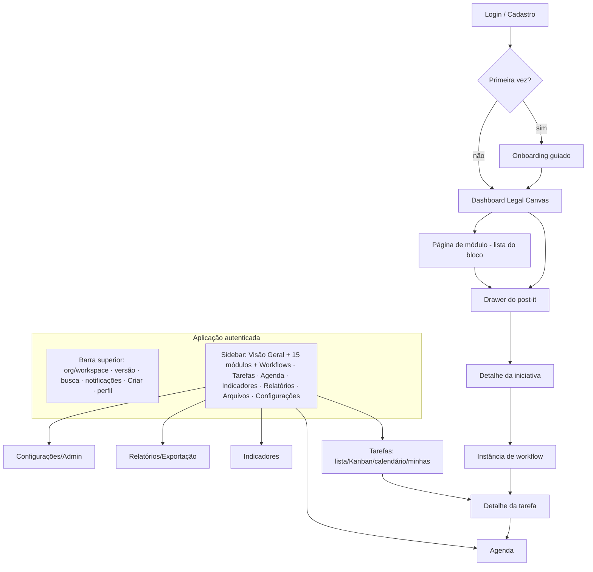
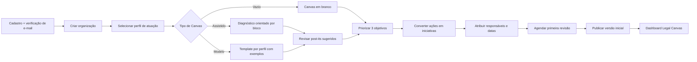
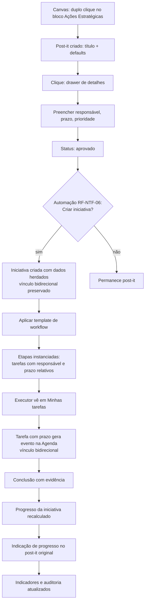
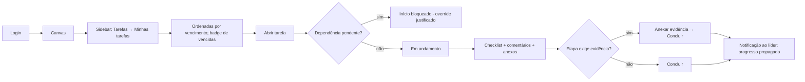
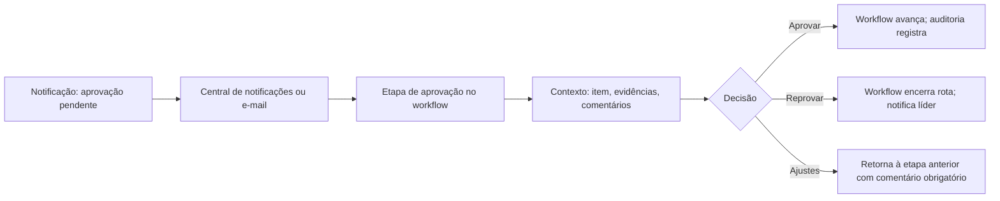
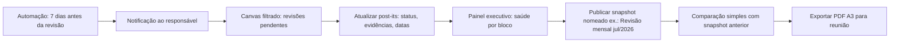
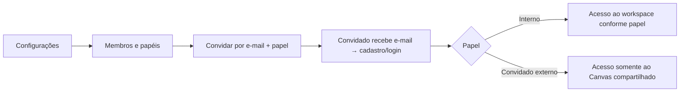

# FLUXOS DE NAVEGAÇÃO — LEGAL CANVAS WEB (MVP)

**Versão:** 1.0
**Origem:** BLUEPRINT.md v1.0 + PRD_MVP.md
**Objetivo:** mapear jornadas e fluxos de navegação para orientar wireframes, protótipo e testes de usabilidade.

---

## 1. MAPA DE NAVEGAÇÃO GLOBAL



**Regra de ouro (princípio 1 do blueprint):** após o login, o usuário sempre cai no **Canvas** do último workspace ativo.

---

## 2. JORNADA 1 — PRIMEIRO ACESSO E ONBOARDING (RF-ADM-02)

**Persona:** advogado individual ou sócio gestor. **Objetivo:** publicar o primeiro Canvas em < 60 min.



**Pontos de saída:** o wizard pode ser pulado em qualquer passo ("fazer depois") e retomado por banner persistente no Canvas até a publicação da versão inicial.

---

## 3. JORNADA 2 — CADEIA CENTRAL: POST-IT → INICIATIVA → WORKFLOW → TAREFA → AGENDA

A jornada que materializa a síntese de arquitetura do blueprint.



**Estados críticos de interface:**
- Conversão em iniciativa: modal de 1 passo, campos pré-preenchidos, botão único "Criar iniciativa" (RF-INI-01).
- Aplicação de workflow: seleção de template → pré-visualização das tarefas que serão geradas (responsáveis/prazos calculados) → confirmar.
- Bloqueio de etapa obrigatória: tentativa de pular exige modal de justificativa (RF-WKF-07).

---

## 4. JORNADA 3 — EXECUTOR NO DIA A DIA



---

## 5. JORNADA 4 — APROVADOR (SÓCIO GESTOR)



---

## 6. JORNADA 5 — REVISÃO PERIÓDICA E SNAPSHOT



---

## 7. JORNADA 6 — ADMINISTRAÇÃO E CONVITES



---

## 8. FLUXOS DE ERRO E CONCORRÊNCIA

| Situação | Comportamento |
|----------|---------------|
| Edição concorrente (versão defasada) | Salvamento rejeitado; banner "Este item foi alterado por [usuário]"; opções: recarregar / comparar / sobrescrever com confirmação explícita (RF-HIS-04) |
| Queda de conexão durante edição | Indicador de autosave em "erro"; alterações retidas localmente; retentativa automática ao reconectar |
| Mover post-it entre blocos | Modal de confirmação com aviso de mudança semântica (RF-CAN-06) |
| Exclusão | Envio à lixeira com toast "Desfazer"; restauração em Configurações → Lixeira |
| Acesso negado (link direto a item restrito) | Tela 403 sem vazar título/existência do item sigiloso |
| Sessão expirada | Redirect a login com retorno à URL original após autenticação |

---

## 9. NAVEGAÇÃO RESPONSIVA

| Breakpoint | Comportamento |
|------------|---------------|
| Desktop ≥ 1280px | Sidebar fixa recolhível; Canvas com zoom/pan/minimapa; drawer lateral 480px |
| Tablet 768–1279px | Sidebar em drawer; Canvas com pan por toque e pinch-zoom; drawer em tela cheia parcial |
| Celular < 768px | Somente consulta: lista de blocos → lista de post-its → detalhe; Minhas tarefas e Agenda funcionais; edição limitada a status/comentários |

## 10. MAPA DE ROTAS (referência para desenvolvimento)

```
/login, /signup, /recover
/onboarding/*                       # wizard (passos 1–10)
/:org/:workspace                    # Canvas (home autenticada)
/:org/:workspace/blocks/:blockKey   # página do módulo (lista do bloco)
/:org/:workspace/notes/:noteId      # deep-link → Canvas com drawer aberto
/:org/:workspace/initiatives[/:id]
/:org/:workspace/workflows[/:id]        # templates
/:org/:workspace/workflow-runs/:id      # instâncias
/:org/:workspace/tasks[?view=list|kanban|calendar|mine]
/:org/:workspace/calendar
/:org/:workspace/kpis
/:org/:workspace/reports
/:org/:workspace/files
/:org/:workspace/settings/*         # membros, etiquetas, lixeira, auditoria, LGPD
/:org/:workspace/snapshots[/:id]
```
