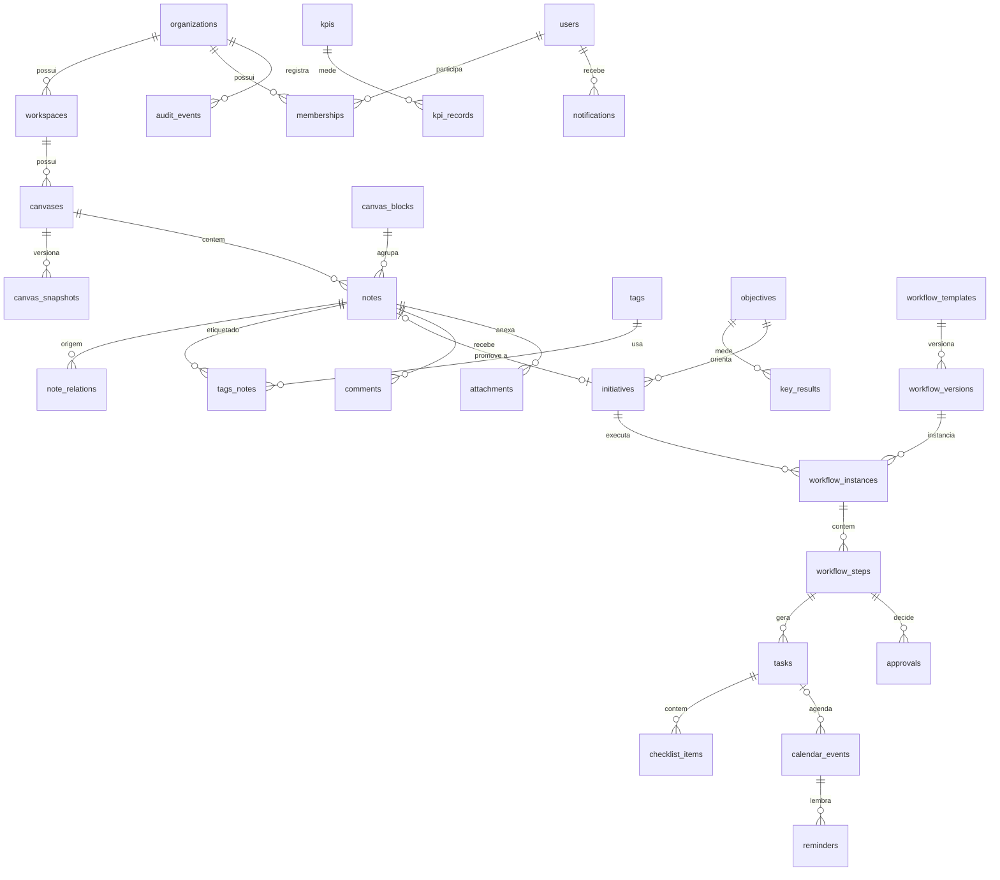

# MODELO LÓGICO DE DADOS — LEGAL CANVAS WEB (MVP)

**Versão:** 1.0
**Origem:** BLUEPRINT.md v1.0 (seção 9) + PRD_MVP.md
**SGBD alvo:** PostgreSQL 15+ (Supabase), com Row Level Security por organização/workspace
**Convenções:** tabelas em `snake_case` plural; PK `id uuid default gen_random_uuid()`; timestamps em UTC (`timestamptz`); dinheiro em `numeric(14,2)` + `currency char(3)`; soft delete via `deleted_at`.

---

## 1. CAMPOS TRANSVERSAIS

Salvo indicação contrária, toda tabela de domínio possui:

| Coluna | Tipo | Notas |
|--------|------|-------|
| `id` | uuid PK | |
| `organization_id` | uuid FK → organizations | base da RLS |
| `workspace_id` | uuid FK → workspaces | quando aplicável |
| `created_at` / `created_by` | timestamptz / uuid FK → users | |
| `updated_at` / `updated_by` | timestamptz / uuid FK → users | |
| `deleted_at` | timestamptz null | soft delete (lixeira, RF-PIT-10) |
| `version` | integer default 1 | versionamento otimista (RF-HIS-04) |
| `confidentiality_level` | enum `padrao\|restrito\|sigiloso` | onde aplicável |
| `metadata` | jsonb default '{}' | extensões controladas |

`updated_at`/`version` mantidos por trigger; `UPDATE` com `version` defasado é rejeitado.

---

## 2. DIAGRAMA ENTIDADE-RELACIONAMENTO (visão principal)



---

## 3. DICIONÁRIO DE DADOS

### 3.1 Identidade e acesso

**`organizations`** — sem `organization_id`/`workspace_id`.

| Coluna | Tipo | Notas |
|---|---|---|
| `name` | text NOT NULL | |
| `slug` | citext UNIQUE NOT NULL | usado em rotas |
| `profile` | enum `individual\|sociedade\|departamento\|legaltech` | perfil de atuação (onboarding) |
| `settings` | jsonb | retenção da lixeira, calendário de feriados, limites |

**`users`** — espelho de `auth.users` (Supabase) com perfil da aplicação.

| Coluna | Tipo | Notas |
|---|---|---|
| `email` | citext UNIQUE NOT NULL | |
| `full_name` | text | |
| `timezone` | text default 'America/Sao_Paulo' | RNF-09 |
| `locale` | text default 'pt-BR' | |
| `notification_prefs` | jsonb | RF-NTF-03 |
| `mfa_enabled` | boolean default false | RF-AUT-09 |

**`workspaces`**: `organization_id`, `name`, `slug` (UNIQUE por org), `settings jsonb`.

**`memberships`** — papel do usuário na organização (UNIQUE `organization_id, user_id`).

| Coluna | Tipo | Notas |
|---|---|---|
| `user_id` / `organization_id` | uuid FK | |
| `role` | enum `owner\|admin\|strategic_editor\|executor\|reader\|external_guest` | matriz RN-AUT-01 |
| `status` | enum `invited\|active\|suspended` | |
| `invited_email` | citext null | convite antes do cadastro (RF-AUT-05) |

**`workspace_grants`** — acesso delimitado de convidados externos (RF-AUT-06): `membership_id`, `workspace_id`, `canvas_id null`, `access enum reader|editor`.

### 3.2 Canvas e post-its

**`canvas_blocks`** — tabela de referência global (seed fixo, 15 linhas): `key` (`equipe`, `parceiros`, `atividades_chave`, `acoes_estrategicas`, `recursos`, `espirito`, `diferenciais`, `modelo_negocio`, `relacionamento_clientes`, `marketing_juridico`, `mercado_juridico`, `produtos_servicos`, `segmento_cliente`, `estrutura_custo`, `fontes_receita`), `name`, `display_order`, `field_schema jsonb` (campos específicos por módulo — RF-PIT-11).

**`canvases`**

| Coluna | Tipo | Notas |
|---|---|---|
| `workspace_id` | uuid FK | |
| `name` | text NOT NULL | |
| `status` | enum `draft\|published` | publicação do onboarding |
| `color_mode` | enum `manual\|category\|priority\|status\|owner` | RF-CAN-08 |
| `block_note_limit` | int default 20 | RN-CAN-01 |

**`canvas_snapshots`** — snapshots nomeados (RF-HIS-05): `canvas_id`, `name`, `published_by/at`, `payload jsonb` (estado congelado das notes por bloco). Imutável após criação.

**`notes`** (post-its)

| Coluna | Tipo | Notas |
|---|---|---|
| `canvas_id` | uuid FK NOT NULL | |
| `block_key` | text FK → canvas_blocks | RN-PIT-01 |
| `title` | text NOT NULL | único campo obrigatório na criação |
| `description`, `hypothesis`, `evidence` | text | campos progressivos |
| `status` | enum `rascunho\|em_analise\|aprovado\|planejado\|em_execucao\|bloqueado\|concluido\|descartado\|arquivado` | RF-PIT-03 |
| `priority` | enum `baixa\|media\|alta` null | |
| `impact` / `effort` | enum `baixo\|medio\|alto` null | |
| `color` | text | token de cor |
| `position` | jsonb `{x,y,order,stack_id}` | posição no bloco (RF-CAN-05) |
| `owner_id` | uuid FK → users null | responsável |
| `start_date`, `due_date`, `review_date` | date null | |
| `objective_id` | uuid FK null | |
| `initiative_id` | uuid FK null | vínculo pós-conversão (RF-INI-01) |
| `module_fields` | jsonb | valores dos campos específicos do bloco |

Índices: `(canvas_id, block_key)`, `(owner_id, due_date)`, GIN em `title/description` (busca textual).

**`note_relations`**: `from_note_id`, `to_note_id`, `relation_type enum depends_on|relates_to|derives_from` (RF-PIT-12); UNIQUE nas três colunas; CHECK `from<>to`.

**`tags`**: `workspace_id`, `name` (UNIQUE por workspace), `color`. **`tags_notes`**: junção `tag_id`, `note_id`.

### 3.3 Estratégia e execução

**`objectives`**: `workspace_id`, `title`, `description`, `status enum ativo|concluido|arquivado`, `target_date`. **`key_results`**: `objective_id`, `title`, `metric_unit`, `target_value numeric`, `current_value numeric`.

**`initiatives`**

| Coluna | Tipo | Notas |
|---|---|---|
| `workspace_id` | uuid FK | |
| `source_note_id` | uuid FK → notes null | vínculo bidirecional (CA-INI) |
| `objective_id` | uuid FK null | |
| `title`, `description`, `expected_result` | text | |
| `sponsor_id` / `leader_id` | uuid FK → users | |
| `status` | enum `proposta\|aprovada\|em_execucao\|pausada\|concluida\|cancelada` | |
| `start_date` / `end_date` | date | |
| `progress` | numeric(5,2) default 0 | calculado por tarefas concluídas (RF-INI-02) — desnormalizado, recalculado por trigger/job |
| `risks` | text | |

**`workflow_templates`**: `workspace_id null` (null = template global do sistema), `block_key null` (template por módulo — RF-WKF-02), `name`, `status enum draft|published|archived`.

**`workflow_versions`**: `template_id`, `version_number int`, `definition jsonb` (lista ordenada de etapas: `{name, type: task|approval, required, default_assignee_role, relative_due_days, checklist[], requires_evidence, approver_role}`), `published_at`. Imutável após publicação (RF-WKF-06).

**`workflow_instances`**: `workspace_id`, `workflow_version_id`, `initiative_id`, `is_primary boolean`, `status enum ativo|pausado|concluido|cancelado`, `started_at/by`, `current_step int`.

**`workflow_steps`** — etapas instanciadas.

| Coluna | Tipo | Notas |
|---|---|---|
| `instance_id` | uuid FK | |
| `step_order` | int | linear no MVP |
| `name` | text | |
| `type` | enum `task\|approval` | RF-WKF-03 |
| `required` | boolean | RF-WKF-07 |
| `status` | enum `pendente\|em_andamento\|concluida\|pulada\|reprovada` | |
| `skip_justification` | text null | obrigatório quando `status=pulada` (CHECK) |
| `due_date` | date | calculado do prazo relativo |

**`approvals`**: `workflow_step_id`, `approver_id`, `decision enum aprovado|reprovado|ajustes`, `comment` (obrigatório em `ajustes`/`reprovado`), `decided_at`.

**`tasks`**

| Coluna | Tipo | Notas |
|---|---|---|
| `workspace_id` | uuid FK | |
| `title` | text NOT NULL | |
| `origin_type` | enum `manual\|note\|initiative\|workflow_step` | RF-TSK-01 |
| `note_id` / `initiative_id` / `workflow_step_id` | uuid FK null | conforme origem |
| `assignee_id` | uuid FK → users | |
| `participants` | uuid[] | |
| `priority` | enum `baixa\|media\|alta` | |
| `status` | enum `a_fazer\|em_andamento\|bloqueada\|concluida\|cancelada` | RF-TSK-03 |
| `start_date` / `due_date` | date | |
| `estimate_hours` | numeric(6,2) null | |
| `requires_evidence` | boolean default false | herdado da etapa |
| `evidence` | text / attachment | preenchido na conclusão |
| `recurrence` | jsonb null | `{freq: daily\|weekly\|monthly, until}` |
| `completed_at` | timestamptz null | |

**`task_dependencies`**: `task_id`, `depends_on_task_id`, `override_justification text null` (RF-TSK-04).

**`checklist_items`**: `parent_type enum note|task`, `parent_id`, `label`, `done boolean`, `position int`.

### 3.4 Agenda

**`calendar_events`**

| Coluna | Tipo | Notas |
|---|---|---|
| `workspace_id` | uuid FK | |
| `title` | text | |
| `event_type` | enum `compromisso\|marco\|prazo\|revisao` | RF-AGD-02 |
| `starts_at` / `ends_at` | timestamptz | UTC (RF-AGD-05) |
| `all_day` | boolean | |
| `task_id` | uuid FK null UNIQUE | vínculo 1:1 tarefa↔evento sem duplicação (CA-AGD) |
| `note_id` / `initiative_id` | uuid FK null | |
| `attendees` | uuid[] | |
| `recurrence` | jsonb null | |

**`reminders`**: `event_id`, `user_id`, `remind_at timestamptz`, `channel enum in_app|email`, `sent_at null`.

### 3.5 Indicadores

**`kpis`**: `workspace_id`, `name`, `unit`, `direction enum maior_melhor|menor_melhor`, `target_value numeric`, `note_id null`, `initiative_id null` (RF-IND-02).

**`kpi_records`**: `kpi_id`, `recorded_on date`, `value numeric`, `source enum manual|calculado`, `recorded_by`. UNIQUE `(kpi_id, recorded_on, source)`.

### 3.6 Colaboração e conteúdo

**`comments`**: `parent_type enum note|task|initiative|workflow_step`, `parent_id`, `body text`, `mentions uuid[]` (RF-PIT-06). Índice `(parent_type, parent_id)`.

**`attachments`**: `parent_type/parent_id` (mesmo padrão), `file_name`, `mime_type`, `size_bytes`, `storage_path` (bucket por organização), `av_status enum pending|clean|blocked` (RF-PIT-07).

**`notifications`**: `user_id`, `type` (catálogo RF-NTF-02), `payload jsonb`, `channel enum in_app|email`, `read_at null`, `sent_at`. Particionável por mês em escala.

### 3.7 Governança

**`audit_events`** — **append-only** (sem UPDATE/DELETE; forçado por privilégio e trigger — RF-HIS-03). Sem colunas transversais de atualização.

| Coluna | Tipo | Notas |
|---|---|---|
| `id` | bigint identity PK | ordenável |
| `organization_id` / `workspace_id` | uuid | |
| `actor_id` | uuid null | null = sistema/automação |
| `origin` | enum `ui\|api\|automation\|system` | RF-HIS-01 |
| `entity_type` / `entity_id` | text / uuid | |
| `action` | text | `create\|update\|move\|delete\|restore\|convert\|approve\|skip_step\|export\|login\|permission_change`… |
| `before` / `after` | jsonb | diff de campos relevantes |
| `occurred_at` | timestamptz default now() | |

Índices: `(organization_id, occurred_at)`, `(entity_type, entity_id)`.

**`decision_logs`** (registro de decisão — seção 7 do blueprint, versão mínima no MVP): `workspace_id`, `context`, `alternatives`, `decision`, `decided_by`, `review_date`.

### 3.8 Financeiro gerencial e portfólio (planejamento — decisão nº 6 pendente)

**`cost_items`**: `workspace_id`, `note_id null` (post-it de Estrutura de Custo), `category`, `cost_center`, `nature enum fixa|variavel`, `competence date` (mês), `planned_amount numeric(14,2)`, `actual_amount null`, `currency char(3) default 'BRL'`, `recurrence jsonb`.

**`revenue_items`**: `workspace_id`, `note_id null`, `modality enum partido|exito|pontual|valor_hora|outra`, `service_id null`, `segment_id null`, `competence`, `planned_amount`, `actual_amount null`, `currency`.

**`partners`**, **`services`**, **`client_segments`** — cadastros estruturados vinculáveis a post-its dos módulos correspondentes (`note_id`), com os campos específicos da seção 5 do blueprint em colunas próprias + `module_fields jsonb`. No MVP, esses módulos podem operar somente com `notes.module_fields`; as tabelas dedicadas entram quando houver necessidade relacional (relatórios da Fase 2).

**`integration_connections`** — reservada (Fase 2): `provider`, `scopes`, `status`, `credentials_ref` (nunca credenciais em claro).

---

## 4. SEGURANÇA EM NÍVEL DE LINHA (RLS)

Políticas padrão por tabela de domínio:

1. **Isolamento organizacional:** `organization_id IN (SELECT organization_id FROM memberships WHERE user_id = auth.uid() AND status='active')` — nenhuma consulta cruza organizações (RF-AUT-07).
2. **Escopo de convidado externo:** membros `external_guest` exigem linha correspondente em `workspace_grants` para o workspace/canvas do registro.
3. **Confidencialidade:** `restrito` → owner, participantes, `admin+`; `sigiloso` → somente participantes explícitos (RN-PIT-02). Implementado como função `can_read_note(note_id)` reutilizada nas políticas de `notes`, `comments`, `attachments` e nas exportações.
4. **Escrita por papel:** políticas de INSERT/UPDATE conforme matriz RN-AUT-01 (função `role_at_least(org_id, 'strategic_editor')`).
5. **Auditoria:** `audit_events` sem política de UPDATE/DELETE; leitura restrita a `admin+`.

**Teste obrigatório (CA-AUT):** suíte automatizada que autentica usuários de duas organizações e verifica negação de leitura/escrita cruzada em todas as tabelas expostas.

---

## 5. REGRAS DE INTEGRIDADE E DERIVAÇÃO

| # | Regra | Implementação |
|---|-------|---------------|
| 1 | `notes.initiative_id` e `initiatives.source_note_id` coerentes | trigger de consistência na conversão |
| 2 | `initiatives.progress` = tarefas concluídas / tarefas totais da instância principal | trigger em `tasks` (status) → recálculo; propaga a `notes` via realtime |
| 3 | Evento↔tarefa sem duplicação | `calendar_events.task_id UNIQUE`; mudança de `tasks.due_date` atualiza o evento (trigger); mudança do evento gera proposta (notificação) |
| 4 | Etapa obrigatória pulada exige justificativa | CHECK `(status <> 'pulada') OR (skip_justification IS NOT NULL)` + verificação de papel na API |
| 5 | Versionamento otimista | trigger `BEFORE UPDATE` compara `version` enviada; incrementa em sucesso |
| 6 | Soft delete com retenção | job diário purga `deleted_at < now() - retenção` (padrão 30 dias) |
| 7 | Toda mutação relevante audita | triggers `AFTER INSERT/UPDATE/DELETE` nas tabelas de domínio gravando em `audit_events` |
| 8 | Snapshot imutável | REVOKE UPDATE em `canvas_snapshots` |

---

## 6. ENUMERAÇÕES CENTRALIZADAS

```
role: owner | admin | strategic_editor | executor | reader | external_guest
confidentiality: padrao | restrito | sigiloso
note_status: rascunho | em_analise | aprovado | planejado | em_execucao |
             bloqueado | concluido | descartado | arquivado
task_status: a_fazer | em_andamento | bloqueada | concluida | cancelada
initiative_status: proposta | aprovada | em_execucao | pausada | concluida | cancelada
workflow_template_status: draft | published | archived
workflow_instance_status: ativo | pausado | concluido | cancelado
step_type: task | approval
approval_decision: aprovado | reprovado | ajustes
event_type: compromisso | marco | prazo | revisao
priority / impact / effort: baixa(o) | media(o) | alta(o)
audit_origin: ui | api | automation | system
```

## 7. EVOLUÇÃO PREVISTA (não implementar no MVP)

- **Fase 2:** `canvas_scenarios` (cenários "Atual/Proposto"), paralelismo em `workflow_versions.definition`, `capacity_allocations` (capacidade de equipe), `report_schedules`, `integration_connections` ativa (Google/Outlook), granularidade de permissão por bloco (`block_grants`).
- **Fase 3:** múltiplas unidades (`org_units`), SSO (claims externas em `memberships`), tabelas de sugestão/assistente com trilha de explicabilidade.

O `metadata jsonb` transversal e o `module_fields jsonb` de `notes` são as válvulas de extensão para evitar migrações disruptivas nessas fases.
