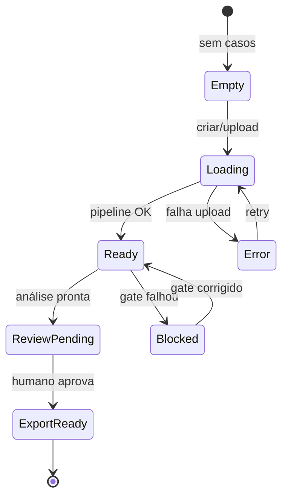

# Wireframes — Dashboard Jurídico (baixa fidelidade)

Referência visual para o squad Apex. Não substitui protótipo Figma; orienta estrutura e hierarquia.

## Mapa de rotas (alvo)

```text
/dashboard                          → Home (carteira)
/dashboard/nova-analise             → Upload wizard (existente — evoluir)
/dashboard/analises/[id]            → Caso (evoluir abas)
/dashboard/analises/[id]/exportar   → Exportação (nova, opcional MVP)
```

Rotas atuais em `analista-processual-web` já cobrem parte do fluxo; **evoluir** em vez de recriar do zero.

---

## Tela 1 — Dashboard (home)

```text
+------------------------------------------------------------------+
| [Logo] Legal Performance          [Busca]    [User] [Nova análise]|
+------------------------------------------------------------------+
| Prazos críticos (7d)     | Riscos altos      | Revisão pendente  |
| [!] 3 casos              | [!] 5 itens       | [ ] 2 casos         |
+--------------------------+-------------------+-------------------+
| Casos ativos                                              [Filtro]|
| +----------------------------------------------------------------+
| | Caso          | Fase      | Risco | Prazo   | Gates | Ações    ||
| | Alfa vs Beta  | Instrução | Alto  | 3 dias  | 2/6   | [Abrir]  ||
| | Indeniz. REsp | Recursal  | Médio | 8 dias  | 4/5   | [Abrir]  ||
| +----------------------------------------------------------------+
| Relatórios recentes                                               |
| - Relatório civil — 01/06 — revisado                              |
+------------------------------------------------------------------+
```

**Notas:** KPIs clicáveis filtram a tabela. Coluna Gates mostra `aprovados/total`. Risco usa ícone + texto + badge (não só cor).

---

## Tela 2 — Caso / Visão geral

```text
+------------------------------------------------------------------+
| <- Dashboard    Alfa Serviços vs Beta    [Risco: Alto] [Exportar]|
+------------------------------------------------------------------+
| [Visão geral] [Documentos] [Timeline] [Riscos] [Jurisprudência]   |
| [Estratégia] [Quality gates]                                      |
+------------------------------------------------------------------+
| HUMAN REVIEW BANNER (se pendente)                                 |
| "Exportação bloqueada até revisão por Dr. Silva"  [Atribuir]      |
+------------------------------------------------------------------+
| Sumário executivo (3-5 linhas)                    [Ver evidências]|
| Próximo passo: conferir prescrição — 3 dias                       |
+------------------------------------------------------------------+
| Quality gates          | Plano de ação (top 3)                   |
| [x] QG-LP-001          | 1. Planilha NF — 3d                    |
| [x] QG-LP-003          | 2. Comprovantes — 5d                    |
| [ ] QG-LP-008          | 3. Memória cálculo — 7d                 |
+------------------------------------------------------------------+
```

**Exportar:** desabilitado se `QG-LP-006` ou `QG-LP-008` pendentes; tooltip explica o gate.

---

## Tela 3 — Documentos + Upload wizard

### Lista de documentos

```text
+------------------------------------------------------------------+
| Documentos                                    [+ Adicionar peças] |
+------------------------------------------------------------------+
| Tipo        | Nome              | Status    | Extração | Ações   |
| Petição     | Inicial           | OK        | Revisar  | [...]   |
| Contestação | Contestação       | OK        | Revisar  | [...]   |
| Decisão     | Saneamento        | Lacuna    | Pendente | [...]   |
+------------------------------------------------------------------+
```

### Wizard (modal ou página)

```text
 Passo 1/3 — Selecionar arquivos
 [ drop zone: PDF, DOCX, max 25MB ]

 Passo 2/3 — Classificar
 [ ] Petição  [x] Contestação  [ ] Outro
 Sigilo: [ ] Dados sensíveis

 Passo 3/3 — Lacunas detectadas
 - Data da decisão de saneamento não encontrada
 [Confirmar e enviar]  [Voltar]
```

---

## Tela 4 — Timeline processual

```text
+------------------------------------------------------------------+
| Timeline                                    [Filtro: todos | prazo]|
+------------------------------------------------------------------+
| 2026-05-10  Petição inicial        fonte: doc #1    [evidência] |
| 2026-05-20  Contestação            fonte: doc #2    [evidência] |
| 2026-05-28  Saneamento             fonte: doc #3    [evidência] |
| 2026-06-05  *** Prazo instrução *** (estimado)      [manual]    |
+------------------------------------------------------------------+
```

Cada evento: data, descrição, **origem** (documento ID ou manual), link abre Evidence drawer.

---

## Tela 5 — Matriz de riscos

```text
+------------------------------------------------------------------+
| Riscos                    Ordenar: [Impacto v]  [Probabilidade]   |
+------------------------------------------------------------------+
| Risco              | Prob. | Impacto | Base legal    | Mitigação|
| Prescrição parcial | Alta  | Alta    | CC 205/206    | Planilha |
| Ônus da prova      | Média | Alta    | CPC 373,I     | Docs     |
| Excesso juros      | Média | Média   | CC 389/406    | Recálculo|
+------------------------------------------------------------------+
| [Abrir evidência] em cada linha                                   |
+------------------------------------------------------------------+
```

---

## Tela 6 — Quality gates

```text
+------------------------------------------------------------------+
| Quality gates                                    5/6 aprovados     |
+------------------------------------------------------------------+
| ID         | Status    | Descrição breve              | Ação      |
| QG-LP-001  | Aprovado  | UC definido                  | -         |
| QG-LP-008  | Bloqueado | Relatório incompleto         | [Corrigir]|
+------------------------------------------------------------------+
```

Estado **Bloqueado** explica qual seção falta e qual agente/task pode resolver (somente informativo na UI).

---

## Componente transversal — Evidence drawer

```text
                                    +---------------------------+
                                    | Evidência            [X]  |
                                    +---------------------------+
                                    | Fonte: Contestação (doc2)|
                                    | Trecho: "prescrição..."  |
                                    | Tipo: peca-processual    |
                                    | Confiabilidade: media    |
                                    +---------------------------+
                                    | [Abrir documento]         |
                                    +---------------------------+
```

Drawer acionado de sumário, timeline, matriz de riscos e citações.

---

## Fluxo de estados (UI)



---

## Tokens semânticos (sugestão CSS)

| Token | Uso |
|---|---|
| `--risk-critical` | Prazo fatal, gate bloqueado |
| `--risk-warning` | Lacuna, fonte média |
| `--risk-success` | Gate aprovado, revisão OK |
| `--risk-neutral` | Metadados, documentos |

Mapear para variáveis existentes em `globals.css` / tema shadcn (`destructive`, `warning`, `muted`).
